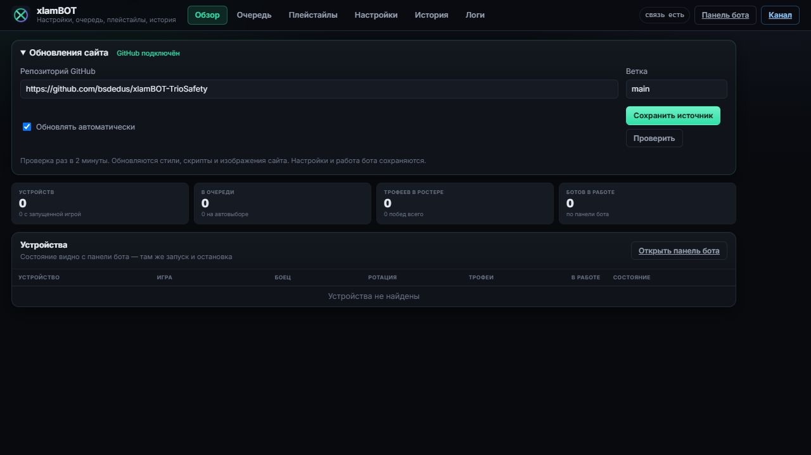
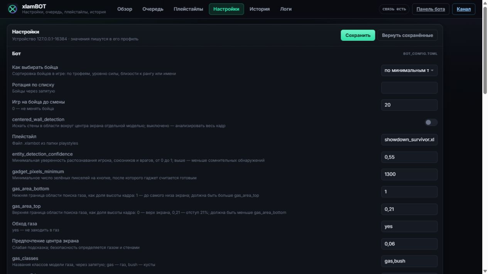
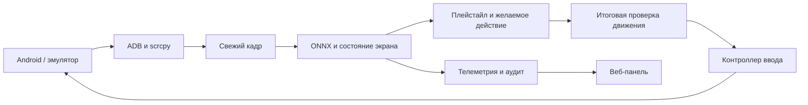

<div align="center">


# xlamBOT · Trio Safety

**Локальный бот для Brawl Stars с веб-панелью на русском языке**

Trio Showdown · распознавание экрана · контроль движения · профили устройств


[](LICENSE)

[Репозиторий](https://github.com/bsdedus/xlamBOT-TrioSafety) · [Releases](https://github.com/bsdedus/xlamBOT-TrioSafety/releases) · [Быстрый старт](#-быстрый-старт) · [Интерфейс](#-интерфейс) · [Исходники](#-запуск-из-исходников) · [Обновления](#-автообновление-сайта) · [Диагностика](#-диагностика-и-типичные-ошибки)

</div>

> [!NOTE]
> Это изменённая версия xlamBOT на базе **v0.8.15**, ориентированная на **Trio Showdown**. Локальные тесты проверяют защитные механизмы и работу программы. Качество распознавания газа и долговременная стабильность эмулятора требуют дальнейшей проверки; бот не гарантирует победы или отсутствие игровых ошибок.

## ✨ Возможности

| Возможность | Что делает |
| --- | --- |
| Веб-панель на русском | Показывает устройства, состояние бота, очередь, статистику, историю и логи. |
| Понятные настройки | Под техническими названиями параметров находятся русские пояснения, единицы и ограничения. |
| Анимации | Плавное переключение вкладок, появление карточек и подсветка изменившихся показателей. Учитывается системная настройка уменьшения движения. |
| Очередь и ротация | Настройки выбора бойца, порядка игры и числа матчей до смены. |
| Профили устройств | Настройки и история сохраняются отдельно для каждого устройства. |
| Распознавание экрана | Четыре ONNX-модели анализируют игрока, сущности, газ и стены; шаблоны помогают распознавать состояния игры. |
| Контроль движения | Итоговая проверка направления учитывает распознанный газ, стены, область наблюдения и свежесть кадра. |
| Защита ввода | При потере игрока или свежего изображения управление освобождается; watchdog ограничивает длительность удержания. |
| Контроль соединения | Ошибки захвата и ADB имеют тайм-ауты. После длительного отсутствия свежих кадров бот останавливается с сообщением. |
| Обновление ресурсов сайта | Новые стили, скрипты и разрешённые изображения из GitHub применяются без перезапуска процесса бота. |
| Диагностика и replay | Проверка ресурсов и моделей, запись событий матча и повторный анализ сохранённых наблюдений. |

## 🖥 Интерфейс

### Панель и обновления



На вкладке «Обзор» отображаются обнаруженные устройства и показатели работы. «Панель бота» открывает управление запуском, паузой и остановкой. В блоке «Обновления сайта» задаются репозиторий, ветка и автоматическая проверка.

### Настройки с объяснениями



Технические имена сохранены для сопоставления с TOML-файлами. Например, `gas_area_bottom` — нижняя граница поиска газа как доля высоты кадра: значение `1` означает до самого низа экрана.

## 🚀 Быстрый старт

### Готовая программа для Windows

1. Если к этому репозиторию прикреплён релиз, скачайте **Setup** или **Portable** из раздела **Releases**. Если готового релиза нет, используйте [запуск из исходников](#-запуск-из-исходников).
2. Для Setup запустите установщик. Для Portable распакуйте **весь архив**: `xlamBOT.exe` должен оставаться рядом с папкой `_internal`.
3. Запустите эмулятор, откройте Brawl Stars и выберите **Trio Showdown** в лобби.
4. Запустите xlamBOT. При первом запуске мастер поможет найти ADB и устройство.
5. В панели проверьте устройство, очередь бойцов и плейстайл. Нажмите **«Старт»** на нужном устройстве.

Панель обычно доступна по адресу **http://127.0.0.1:5195**. Если порт занят, программа выбирает следующий свободный порт и сообщает адрес при запуске.

> [!TIP]
> В проверенной локальной конфигурации использовался **MuMuPlayer 6.8 / Android 15**. Адрес ADB зависит от экземпляра эмулятора: не копируйте чужой порт вслепую. Вход в игру и Supercell ID выполняется пользователем.

### Что нужно

| Компонент | Требование / проверенное окружение |
| --- | --- |
| ОС | Windows x64. Локальные сборки и проверки выполнены на Windows 11; Windows 10 отдельно не проверена. |
| Игра | Brawl Stars в доступном через ADB Android-устройстве или эмуляторе. Эта версия требует подтверждения Trio Showdown перед стартом. |
| Распознавание | ONNX Runtime с DirectML; при недоступности ускорения предусмотрен CPU fallback. Отдельная NVIDIA GPU не обязательна. |
| ADB | Рабочий ADB из эмулятора либо Android Platform Tools; устройство должно быть online. |
| OCR | Tesseract с языковыми данными `eng`. В готовую сборку он включается при упаковке. |
| Сеть | Для игры и проверки GitHub. Панель работает локально; облачная учётная запись xlamBOT не требуется. |
| Для исходников | Python **3.12 x64**, зависимости проекта; для установщика дополнительно Inno Setup 6. |

## 🧩 Запуск из исходников

Скачайте исходники через **Code → Download ZIP** или клонируйте репозиторий:

```powershell
git clone https://github.com/bsdedus/xlamBOT-TrioSafety.git
cd xlamBOT-TrioSafety
```

 Откройте PowerShell в папке проекта:

```powershell
py -3.12 -m venv .venv
.\.venv\Scripts\python.exe -m pip install --upgrade pip
.\.venv\Scripts\python.exe -m pip install -r requirements.txt
```

Установите [Tesseract для Windows](https://github.com/UB-Mannheim/tesseract/wiki), если он отсутствует. Затем запустите:

```powershell
# Отдельная папка пользовательских данных для запуска из исходников.
$env:XLAMBOT_DATA_DIR = Join-Path $env:LOCALAPPDATA 'xlamBOT'
.\.venv\Scripts\python.exe xlambot_launcher.py
```

Без `XLAMBOT_DATA_DIR` запуск из исходников хранит изменяемые данные в папке проекта. Готовый EXE по умолчанию использует `%LOCALAPPDATA%\xlamBOT`.

Для запуска HTTP-панели без автоматического открытия окна:

```powershell
.\.venv\Scripts\python.exe xlambot_launcher.py --headless
```

`requirements.txt` задаёт диапазоны зависимостей. `requirements-build-lock.txt` фиксирует версии, использованные при локальной сборке; для воспроизведения именно этого окружения устанавливайте lock-файл в отдельную виртуальную среду Python 3.12.

## ⚙ Настройка игры

1. Откройте Brawl Stars в лобби и выберите Trio Showdown. Подтверждённый Solo или Duo блокирует запуск этой версии.
2. В «Очереди» настройте бойцов и цели. Выбор/ротация также зависит от параметров лобби.
3. В «Настройках» выберите плейстайл, например `showdown_survivor.xlambot`, и сохраните изменения.
4. Проверьте предпросмотр и статус соединения, затем запустите устройство.

Основные параметры газа:

| Параметр | Значение по умолчанию | Смысл |
| --- | --- | --- |
| `gas_area_top` | `0.21` | Начало области поиска газа: отступ 21% высоты от верхнего края. |
| `gas_area_bottom` | `1.0` | Нижняя граница области поиска: до нижнего края кадра. Должна быть больше `gas_area_top`. |
| `gas_confidence` | `0.25` | Минимальная уверенность обнаружения газа. Меньше значение — больше обнаружений, включая сомнительные. |
| `gas_danger_enter` | `0.14` | Порог доли тела игрока, покрытой распознанным газом, для входа в состояние опасности. |
| `gas_danger_exit` | См. профиль | Порог выхода из опасности; не должен превышать `gas_danger_enter`. |
| `gas_centre_bias` | `0.06` | Слабое предпочтение центра. Проходимость оценивается отдельно по газу и стенам. |

Изменения через сайт записываются в профиль выбранного устройства. Проверяйте выбранное устройство перед сохранением. Пояснения всех отображаемых параметров находятся прямо в интерфейсе.

## 🔄 Автообновление сайта

В блоке «Обновления сайта» укажите URL **этого репозитория**, ветку `main` и включите автоматическую проверку. Текущая реализация работает с **публичными** GitHub-репозиториями без токена.

| Поведение | Как устроено |
| --- | --- |
| Проверка GitHub | Примерно раз в **120 секунд**; кнопка проверки запускает проверку вручную с учётом ограничений API. |
| Первое подключение | Сохраняется исходное состояние GitHub. Уже имеющиеся локальные ресурсы сохраняются. Обновления применяются при последующих изменениях ресурсов в ветке. |
| Какие файлы обновляются | CSS, JS, изображения и шрифты в `static/`; иконки бойцов в `api/assets/brawler_icons/` и `brawler_icons2/`; `images/xlambot_logo.png`. |
| Проверка файлов | Скачивание привязано к одному коммиту; проверяются размер и Git blob hash. |
| Применение | Новая версия подготавливается полностью, затем переключается активный каталог. При ошибке сохраняется прежняя рабочая версия. |
| Открытая страница | Проверяет локальный статус раз в **5 секунд**, обновляется и возвращается на прежнюю вкладку. |
| Несохранённая форма | Обновление страницы откладывается до сохранения или возврата к сохранённым значениям. |

**Python-код, ONNX-модели, игровые шаблоны, HTML-шаблоны, настройки, очередь и история этим механизмом не обновляются.** Для изменения программы нужна новая сборка или обновление исходников. Кэш находится в `web_resources/` внутри каталога данных пользователя.

## 🛠 Сборка EXE и установщика

В отдельной среде Python 3.12 установите сборочные зависимости:

```powershell
.\.venv\Scripts\python.exe -m pip install -r requirements-build-lock.txt
```

Установите Inno Setup 6 и Tesseract. Скрипт сборки копирует необходимый Tesseract в `vendor/tesseract`, генерирует очередь и метаданные версии, собирает программу и установщик:

```powershell
powershell -ExecutionPolicy Bypass -File .\install.ps1
```

Результат:

```text
dist/
├── xlamBOT/                       # переносимая папка целиком
│   ├── xlamBOT.exe
│   └── _internal/
└── xlamBOT-Setup-<версия>.exe      # установщик
```

Версия задаётся в `version.py`. `tools_build_metadata.py` синхронизирует её с метаданными Windows EXE и Inno Setup. Отдельная установка **xlamBOT Trio Safety** использует каталог текущего пользователя; профили находятся отдельно от программы.

## 🧪 Проверки и качество

Для тестов используется отдельный временный каталог:

```powershell
.\.venv\Scripts\python.exe -m pip install pytest
.\.venv\Scripts\python.exe -m pytest tests -q --basetemp .audit\pytest-readme
```

На версии **0.8.15.post5** локально прошли **123 теста**. Они проверяют геометрию и ограничения движения, watchdog, захват и восстановление соединения, владение устройством, профили, состояния игры, аудит и обновление ресурсов. Имеется предупреждение зависимости Discord об устаревшем `audioop`.

Ранее проведены **15 реальных матчей** на нескольких последовательных ревизиях. Это не означает 15 безошибочных матчей одной финальной сборки. У моделей остаются ошибки восприятия; расширенная проверка текущей сборки на MuMu ещё не завершена. Число пройденных unit-тестов не измеряет качество игры.

Подробности: [итоговая игровая проверка](reports/FINAL_VALIDATION.md), [изменения базовой версии](reports/BASELINE_AND_CHANGES.md), [анимации и обновления](reports/ANIMATIONS_AUTOUPDATE_2026-10-05.md), [русские пояснения](reports/RUSSIAN_SETTINGS_HINTS_2026-10-05.md).

## 🔍 Диагностика и типичные ошибки

Проверить наличие ресурсов и реальный ONNX inference можно без игровых нажатий:

```powershell
.\xlamBOT.exe --diagnostics --load-models
```

Для исходников:

```powershell
.\.venv\Scripts\python.exe xlambot_launcher.py --diagnostics --load-models
```

| Проблема | Причина / действие |
| --- | --- |
| `!"myBlobMmioRead"`, `uCountStall < 100` в LDPlayer | Сообщения найдены в закрытом графическом модуле LDPlayer `fastpipe2.dll`. Изменения параметров и захвата не устранили повторение в проверенной VM. Использован переход на MuMu с другим графическим движком; внутренний дефект LDPlayer не исправлен исходниками этого бота. |
| `adb read timeout` | Устройство не отвечает вовремя. Проверьте, что эмулятор работает, устройство online и выбран его действительный ADB-адрес. После восстановления соединения запустите бота снова. |
| Устройство уже занято | Другой процесс владеет захватом/управлением. Остановите другой экземпляр. Не запускайте диагностику захвата одновременно с игрой бота. |
| Нет подтверждения Trio | Откройте лобби, выберите Trio Showdown и дождитесь завершения анимации/загрузки. |
| Нет OCR / кубки не определены | Проверьте Tesseract и `eng.traineddata`. Нераспознанное значение не подменяется выдуманным результатом. |
| Обновления сайта не применяются | Проверьте публичность репозитория, ветку и наличие нового коммита с разрешёнными ресурсами. Первое подключение устанавливает базовую точку. Ошибка сети или лимит API отображается в статусе. |

Подробное исследование: [отчёт LDPlayer → MuMu](reports/LDPLAYER_THIRD_FAILURE_2026-10-05.md).

## 🗂 Структура проекта

```text
xlambot_launcher.py        Запуск приложения, мастер, сервер, диагностика
bot_instance.py           Жизненный цикл бота и обработка кадров
play.py                   Игровые действия
navigation_safety.py      Проверка движения по газу и стенам
gas_config.py             Параметры газовой системы и валидация
window_controller.py      Ввод и освобождение удержаний
adb_connection.py         Ограниченные по времени операции ADB
device_lease.py           Владение захватом и вводом устройства
detect.py                 ONNX inference и fallback
state_finder.py           Распознавание состояния экрана
stage_manager.py          Переходы между стадиями, проверка Trio
life_tracking.py          Учёт жизни, смерти и возрождения
match_audit.py            События для разбора матчей
replay_navigation.py      Повторная проверка наблюдений
webui/                    Flask API, устройства, обновление ресурсов
static/, templates/       Стили, скрипты и шаблоны веб-панели
models/, images/          Модели и игровые шаблоны
cfg/, playstyles/         Начальные настройки и плейстайлы
scrcpy/                   Изображение и канал управления
tests/, reports/          Тесты и отчёты проверок
installer.iss             Установщик Inno Setup
```

Поток обработки:



## 🤝 Разработка

При изменении игрового поведения добавляйте проверку соответствующего риска и описывайте ограничения. Изменения моделей следует проверять на размеченных кадрах отдельно от тестов геометрии. Перед сборкой обновите `version.py` и выполните тесты.

В репозиторий входят исходники, модели, шаблоны, стандартные конфигурации, документация и тесты. Локальные профили, ключи доступа, история аккаунта, резервные копии эмуляторов, `.venv`, кэш проверки и готовые тяжёлые сборки исключены. Готовые сборки распространяются через Releases, когда опубликованы.

## 📜 Лицензия и авторы

Проект сохраняет [CC BY-NC 4.0](LICENSE) и атрибуцию исходного [PylaAI / xlamBOT](https://github.com/PylaAI/PylaAI). Исходные авторы: **ivanyordanovgt**, **AngelFireLA**, **awarzu**. Базовая версия этого варианта — xlamBOT v0.8.15, commit `9540ce82cef79c83a7711e6445e440df31542fa3`; дальнейшие изменения описаны в `reports/`.

Участники исходного проекта: Maayan080, simonrejzek, bocchi-the-cat, Ariko842, Nauwk07, aetherwtff, fazelukario, k00shi, mydd7.

При распространении сохраняйте указание авторов и информацию о лицензии. Коммерческое использование не разрешено этой лицензией. Сторонние компоненты и игровые материалы принадлежат их правообладателям; лицензия проекта не заменяет их условий.
